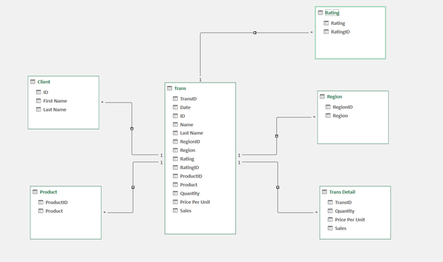

# Step 1 Data Cleaning Process 

- load the raw file
- fit columns and rows width and height
- TRIM extra spaces
- Remove null value
- Remove Duplicates

# Step 2 Normalization 

- Perform 1NF
- Perform Table Split using 2NF
- Then perform 3NF to remove the duplicates
- After that make ERD

# Step 3 Screenshot before data cleaning 

# Step 4 Screenshot after data cleaning

# Step 5 ERD

